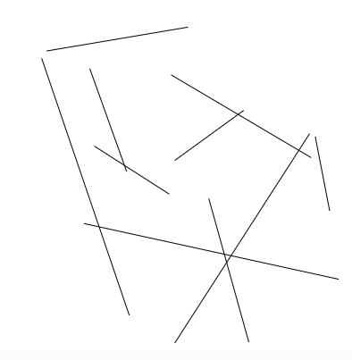

``` js
function setup() {
  createCanvas(400, 400);
  noLoop();
}

function draw() {
  background(255);
  
  for (let i = 0; i < 10; i++) {
    let x1 = random(width);
    let y1 = random(height);
    let x2 = random(width);
    let y2 = random(height);
    
    line(x1, y1, x2, y2);
  }
}
```
El código anterior fue usado para generar de forma basica unos patrones aleatorios de 10 lineas. Se usó la función básica random para dar valores aleatorios a los valores de cada linea, esto repitiendose hasta hacerse 10 veces. Luego se grafican todas las lineas y queda un patrón visual de lineas diferente cada vez.
Imagenes patrones


