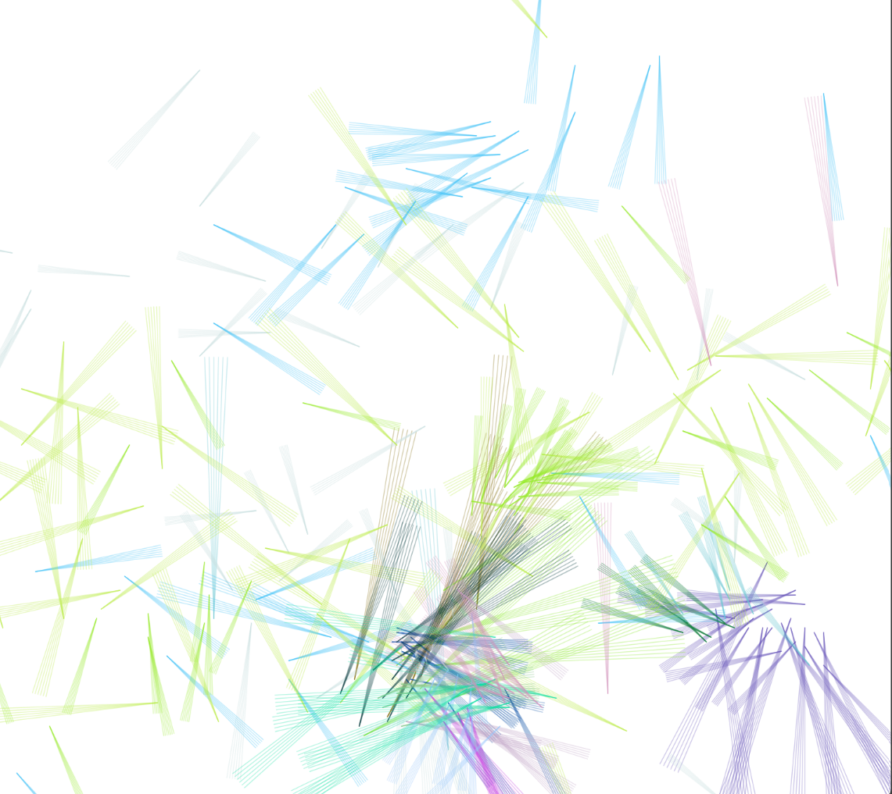
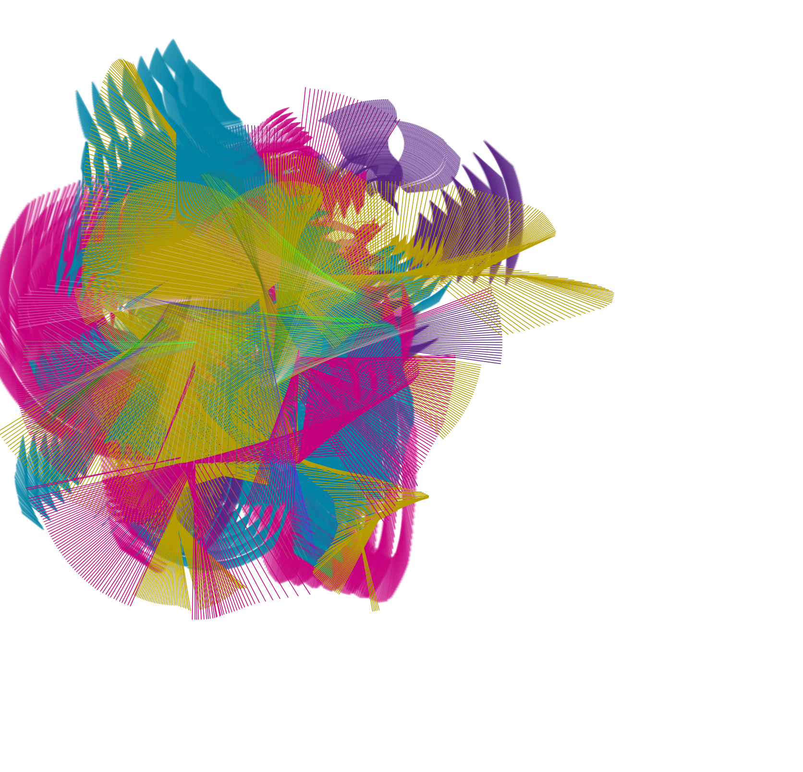

## Actividad  2

### Funcionalidad del código

Este sketch permite dibujar usando diferenes formas rotatorias y colores por medio de input interactivo.
El funcionamiento principal se basa en detectar los movimientos del mouse y aplicar transformaciones para generar trazos.

En la función preload(), se cargan imágenes SVG que se usarán como pinceles, y se guardan en un arreglo llamado lineModule.
Estas imágenes están en la carpeta data/ y se seleccionan luego con las teclas del 5 al 9.

En setup(), se crea un lienzo del tamaño de la ventana (createCanvas(windowWidth, windowHeight)) y se asigna un color de fondo blanco.
También se oculta el cursor con noCursor() para que no interfiera visualmente con el pincel.

La función principal es draw(). Cada vez que el mouse está presionado (mouseIsPressed), se obtiene la posición actual del mouse y, si se mantiene presionada la tecla Shift, el trazo se restringe a una línea horizontal o vertical. 
Luego, se usa translate(x, y) para mover el sistema de coordenadas al punto donde está el mouse, y rotate(radians(angle)) para aplicar una rotación al pincel. Dependiendo del módulo elegido, se dibuja una imagen (image()) o una línea (line()).
Después de dibujar, el ángulo se incrementa con angle += angleSpeed, lo que genera el efecto de rotación continua mientras se arrastra el mouse.

La función mousePressed() se activa al hacer clic. Allí se genera un tamaño aleatorio para el pincel (entre 50 y 160) y se guarda la posición inicial del clic, necesaria para calcular la dirección del trazo cuando se usa Shift.

Las funciones keyPressed() y keyReleased() controlan las interacciones por teclado. Con las flechas se puede cambiar el tamaño del pincel o la velocidad de rotación.
La tecla d invierte la dirección del giro, la barra espaciadora cambia el color a uno aleatorio, y las teclas 1 a 4 activan colores predefinidos. La tecla s guarda el dibujo como PNG, y delete o backspace limpian el lienzo.

Estas son algunas imagenes hechas en el programa:

Esta fue la primera que hice, es sencilla y solo se usa un pincel

En esta si se ve otro tipo de pinceles y más color

Se pueden lograr infinidad de imagenes usado todas las variaciones de pinceles y colores posibles, todo de manera interactiva y sencilla para el usuario.

