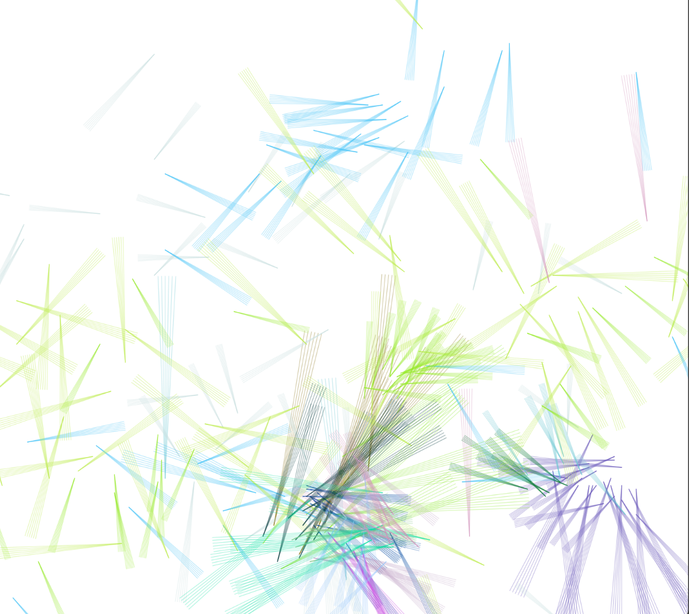
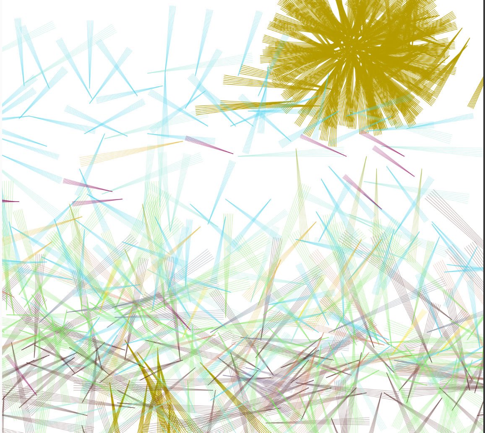

## Análisis del caso de estudio

### ¿Cómo se están comunicando el micro:bit y el sketch de p5.js?

La comunicación entre el micro:bit y el sketch de p5.js se realiza a través de una conexión serial.

El micro:bit utiliza la librería uart para enviar datos por su puerto serial a 115200 baudios.

El sketch de p5.js, mediante la librería p5.webserial, abre el puerto serial y lee los datos que el micro:bit transmite.

El usuario debe hacer clic en el botón (“Connect to micro:bit”) para autorizar y establecer la conexión entre el navegador y el microbit.

### ¿Qué datos envía el micro:bit?

El micro:bit envía cuatro valores:

- xValue: Aceleración en el eje X (obtenida del acelerómetro).

- yValue: Aceleración en el eje Y (obtenida del acelerómetro).

- aState: Estado del botón A (verdadero si está presionado, falso si no).

- bState: Estado del botón B (verdadero si está presionado, falso si no).

Estos valores se envían cada 100 ms como una línea de texto con los valores separados por comas.

### ¿Cómo es la estructura del protocolo ASCII usado?

El protocolo que usa el microbit para comunicarse es muy sencillo. Cada envío es una cadena de caracteres ASCII con cuatro campos separados por comas ,.
La línea finaliza con un salto de línea \n.

Ejemplo de una línea enviada:

-134,56,False,True

Significa que Acelerómetro X: -134. Acelerómetro Y: 56. Botón A: No presionado (False). Botón B: Presionado (True)

### ¿Dónde y cómo se leen los datos del micro:bit en p5.js?

La lectura ocurre dentro de la función draw() de sketch.js:
``` js
if (port.availableBytes() > 0) {
    let data = port.readUntil("\n");
    if (data) {
      data = data.trim();
      let values = data.split(",");
      if (values.length == 4) {
        microBitX = int(values[0]) + windowWidth / 2;
        microBitY = int(values[1]) + windowHeight / 2;
        microBitAState = values[2].toLowerCase() === "true";
        microBitBState = values[3].toLowerCase() === "true";
        updateButtonStates(microBitAState, microBitBState);
      } else {
        print("No se están recibiendo 4 datos del micro:bit");
      }
    }
}
```
- port.availableBytes() revisa si hay datos nuevos en el puerto serial.

- port.readUntil("\n") lee una línea completa enviada por el micro:bit.

- data.split(",") separa los cuatro valores usando la coma como separador.

Luego:

El valor X e Y del acelerómetro se convierten en enteros y se ajustan sumando la mitad del ancho y alto de la ventana para que el movimiento se vea centrado en pantalla.

Los valores de botones A y B se convierten de texto ("True"/"False") a booleanos (true/false).

Finalmente se llama a updateButtonStates() para gestionar cambios de botones.

### ¿Cómo se generan los eventos "A pressed" y "B released" en p5.js?

Se generan a partir de comparar el estado actual y el estado anterior de los botones:

``` js
function updateButtonStates(newAState, newBState) {
    if (newAState === true && prevmicroBitAState === false) {
        // Evento A pressed
        lineModuleSize = random(50, 160);
        clickPosX = microBitX;
        clickPosY = microBitY;
        print("A pressed");
    }

    if (newBState === false && prevmicroBitBState === true) {
        // Evento B released
        c = color(random(255), random(255), random(255), random(80, 100));
        print("B released");
    }

    prevmicroBitAState = newAState;
    prevmicroBitBState = newBState;
}
```

A pressed: Se detecta cuando el nuevo estado de botón A (newAState) es true y el anterior (prevmicroBitAState) era false. Significa que el botón fue presionado en ese momento.

B released: Se detecta cuando el nuevo estado de botón B (newBState) es false y el anterior (prevmicroBitBState) era true. Significa que el botón fue soltado en ese momento.

En "A pressed" se asigna un nuevo tamaño aleatorio al módulo de línea y guarda la posición actual del micro:bit para usarla como referencia de dibujo.

En "B released" se asigna un color aleatorio al trazo que se dibuja en pantalla.


### Ejemplo de dibujo el el programa



